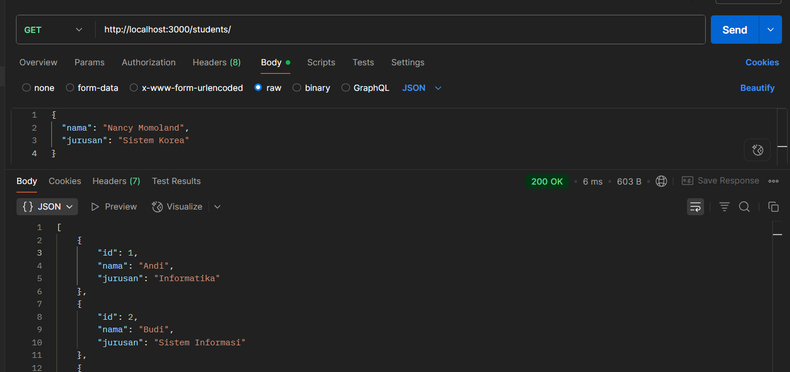
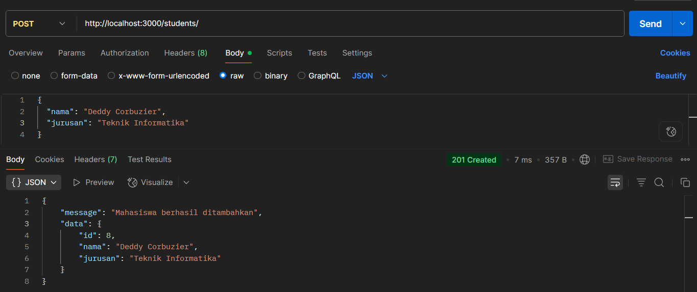
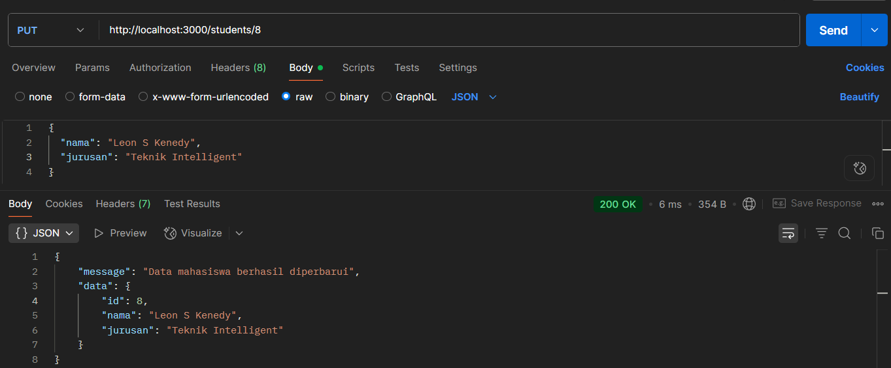
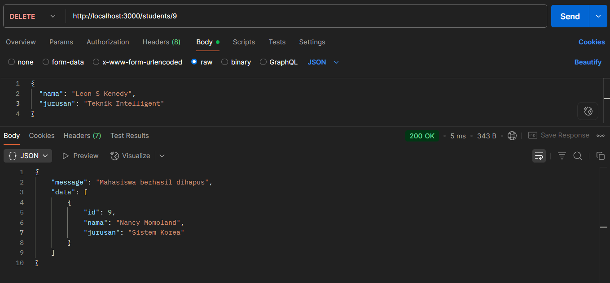
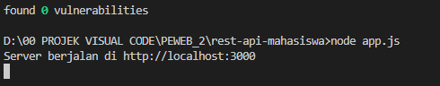

# REST API Mahasiswa - Express.js

## Identitas Mahasiswa

* **Nama:** Zainuddin Muhammad Zakiy
* **NIM:** 23552011173
* **Mata Kuliah:** Pemrograman Web 2
* **Tugas:** Basic REST API Express.js
* **Universitas:** Universitas Teknologi Bandung

---
## Preview API

<p align="center">


</p>

<p align="center">


</p>

<p align="center">

</p>

---
## Deskripsi Project

Project ini merupakan tugas mata kuliah **Pemrograman Web 2** yang bertujuan untuk membuat **REST API sederhana menggunakan Node.js dan Express.js**.

API ini menggunakan **data dummy (array)** tanpa database dan mendukung operasi dasar **CRUD (Create, Read, Update, Delete)** melalui HTTP Method.

Konsep yang dipelajari dalam project ini meliputi:

* Server menggunakan Node.js
* Routing menggunakan Express.js
* HTTP Method (GET, POST, PUT, DELETE)
* Response dalam format JSON
* Parameter URL

---

## Teknologi yang Digunakan

* Node.js
* Express.js
* JSON

---

## Struktur Project

```
rest-api-mahasiswa
│
├── app.js
├── package.json
└── README.md
```

---

## Cara Menjalankan Project

1. Clone repository atau download project

2. Install dependency

```
npm install
```

3. Jalankan server

```
node app.js
```

4. Server akan berjalan pada

```
http://localhost:3000
```

---

## Data Dummy

Data mahasiswa awal yang digunakan dalam project ini:

```javascript
[
  { id: 1, nama: "Andi", jurusan: "Informatika" },
  { id: 2, nama: "Budi", jurusan: "Sistem Informasi" },
  { id: 3, nama: "Citra", jurusan: "Teknik Komputer" },
  { id: 4, nama: "Jule", jurusan: "Teknik Selingkuh" },
  { id: 5, nama: "Farrah", jurusan: "Teknik Matre" }
]
```

---

## Endpoint API

| Method | Endpoint      | Deskripsi                            |
| ------ | ------------- | ------------------------------------ |
| GET    | /             | Mengecek apakah API berjalan         |
| GET    | /students     | Menampilkan semua mahasiswa          |
| GET    | /students/:id | Menampilkan mahasiswa berdasarkan ID |
| POST   | /students     | Menambahkan mahasiswa baru           |
| PUT    | /students/:id | Mengupdate data mahasiswa            |
| DELETE | /students/:id | Menghapus data mahasiswa             |

---

## Contoh Penggunaan API

### 1️⃣ Home Endpoint

**Request**

```
GET /
```

**Response**

```
API Mahasiswa berjalan
```

---

### 2️⃣ Get Semua Mahasiswa

**Request**

```
GET /students
```

**Response**

```json
[
  {
    "id": 1,
    "nama": "Andi",
    "jurusan": "Informatika"
  },
  {
    "id": 2,
    "nama": "Budi",
    "jurusan": "Sistem Informasi"
  }
]
```

---

### 3️⃣ Tambah Mahasiswa

**Request**

```
POST /students
```

**Body JSON**

```json
{
  "nama": "Jule",
  "jurusan": "Informatika"
}
```

---

### 4️⃣ Update Mahasiswa

**Request**

```
PUT /students/:id
```

**Body JSON**

```json
{
  "nama": "Andi Update",
  "jurusan": "Informatika"
}
```

---

### 5️⃣ Hapus Mahasiswa

**Request**

```
DELETE /students/:id
```

Contoh:

```
DELETE /students/2
```

---

## Testing API

API dapat diuji menggunakan beberapa tools berikut:

* Postman
* Thunder Client (VSCode)
* Insomnia
* Browser (untuk request GET)

---

## Kesimpulan

REST API ini berhasil dibuat menggunakan **Node.js dan Express.js** dengan memanfaatkan **data dummy dalam array** tanpa menggunakan database.

API ini mampu melakukan operasi dasar **CRUD (Create, Read, Update, Delete)** terhadap data mahasiswa melalui endpoint yang telah disediakan.

---

## Author

* **Zainuddin Muhammad Zakiy**
* Universitas Teknologi Bandung
* Pemrograman Web 2
